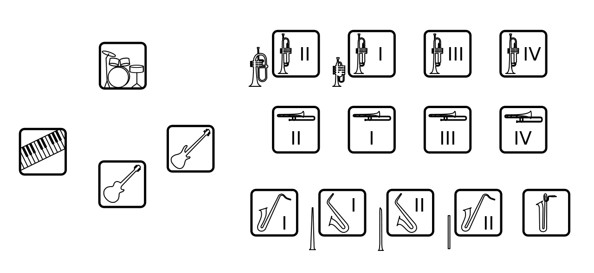

# [College Society Jazz Orchestra(CSJO)とは？](./about.html)
CSJOとは、芝浦工業大学 文化会 軽音楽部の別称です。

私達のバンドは"ビッグバンドジャズ"という構成のバンドです。

ビッグバンドはサックス５人、トロンボーン４人、トランペット４人で成るホーンセクションと、

ピアノ、ギター、ベース、ドラムの１人ずつで成るリズムセクションの計17人という構成が基本のバンドです。

またCSJOでは、3年生を中心としたRegularバンドと1年生と2年生のJuniorバンドで活動しています。

